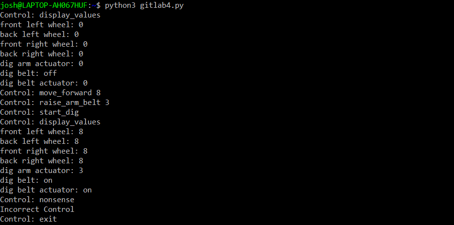

# Gitlab 4 - Python Object Oriented Programming
The first portion of this is a highly detailed description of object oriented programming. Click [here](#the-gitlab) to skip to the gitlab.
## The 'philosophy' of Object Oriented Programming (OOP)
The word philsophy is used very intentionally here. No programming language is 
strictly an object-oriented language, procedural language, or otherwise 
(especially at the highly abstract level). Object oriented programming is 
simply a guideline for how things should work in your program. Some programming 
languages are easier to use if you code according to its OOP philosphy, and so they 
are pseudo-classified as an Object Oriented Programming Language.

*Object Oriented Progamming To the Extreme* - All data is an object with attributes, state, 
and methods.

## What this means
* All data has attributes
  - Attributes are characteristics of the object that can be adjusted to describe the object.
  - For instance, if there was an object "Person", some attributes of person could be "name", "age", "hair color", etc. 
* All data has state
   - State means that, depending on what happens to the object by its environment, an object can change throughout the program and actually behave differently. 
   - This comes fairly intuitively with being able to set attributes
```python
me = Person()            # initialize a person object
me.name = "Josh"         # set my Person Objecct attribute to "Josh"
print(f'Hey {me.name}!') # prints 'Hey Josh!'
me.name = "Greg"
print(f'Hey {me.name}!') # same command, but prints 'Hey Greg!'
```
* All data has methods
  - Functions are snippets of code that your object or class owns and can execute with the data you give it and its attributes. 
  - A very simple function for person might be 'can_i_drink'. This would check if someone is above 21.
```python
def can_i_drink(self):  # self will be explained in the Python specific parts
  return self.age >= 21 # return signifies that, when someone calls this function, give them the result of this expression back
```

## Python OOP

Python2.7 Philosphy => Procedural (Gross)
Python3.x Philosphy => OOP (Pretty) 

Like in almost all programming lanugages, python implements OOP in the form of classes. 
Think of classes as your type of object.

_Josh is to Object, as Person is to class._

```python
class Person:
  def __init__(self, my_name, my_age):
    self.name = my_name
    self.age = my_age

  def say_hi(self):
    print(f'hello! my name is {self.name}') # note: return is not required

  def can_i_drink(self):
    return self.age >= 21

me = Person('Josh', 20)
print(f'hello my name is {me.name}, and I can')
if not me.can_i_drink():
  print('not')
print('drink')
# prints: hello my name is Josh, and I can not drink
```

### The Meaning of Self and Types of Methods
* When you are inside the class of your object, **self** is refering to the object itself.
* In the Person example, the 'self' and 'me' are referring to the same object, 'self' is simply how an object refers to 
itself when working withing its own methods.

When you use 'self', you are indirectly telling Python that your method is 1 of 3 types of methods, an instance method.
The types of methods are simply describe as: 
1. instance method - cares about its Object and its Class, therefore requires self.
2. class method - cares about its Class, therefore requires cls.
3. static method - cares about nothing, could be in Dinosaur class or Car class and it would do the same thing.

```python
class Person:
  LIKES = 'food' # class constant
  def __init__(self, my_name, my_age): #IMPORTANT: all objects need this method, it is called upon creation of the object see example __main__ code for details.
    self.name = my_name
    self.age = my_age

  @classmethod # this is what is called a method decorator, it tells python what you are trying to make here
  def what_my_type_likes(cls):
    return f'{type(cls)} likes {cls.LIKES}'

  @staticmethod
  def greet():
    print('Hello')

  # instance method is default so no decorator
  def can_i_drink(self):
    return self.age >= 21
```
## The Point of OOP
* Once you get used to the structure, objects and classes are very easy to work with, prevalent in Python 3, and very readable.
* Understanding the information above will allow you to fundamentally understand how nearly all code in Python works. 
* The principles of OOP is very effective for building large scale, multi-developer projects and should guide you in how to structure your code for KORA going forward. 

## The Gitlab
For this gitlab, we are going to have you use OOP to implement a small portion of very important code that was on last years robot. That is the message translator. It was middleware that lives on the rover that takes messages from the network and translates them into control signals. 

Here are the specifications for the version of this message translator:

1. Make a class called RoverControl
2. This class's purpose is to store the state of each motor and actuator on the robot. 
3. The motor attributes to account for are: 
    - Front Right Wheel
    - Back Right Wheel
    - Front Left Wheel
    - Back Left Wheel
    - Dig Belt
    - Dig Actuator
    - Dig Arm Actuator
4. The class needs to support 8 methods

|method name| parameters | description |
|-----------|------------|-------------|
|move_forward| speed (0-10) | puts drive motors at speed|
|move_backward | speed (0-10) | puts drive motors at negative speed|
|turn_left | speed (0-10)|puts left drive motors at speed and right drive motors at negative speed|
|turn_right |speed (0-10)|puts right drive motors at speed and left drive motors at negative speed|
|start_dig |none|toggles the dig belt to "on" state|
|stop_dig |none|toggles the dig belt to "off" state|
|lower_arm_belt |speed (0-5)|sets actuator motors to negative speed|
|raise_arm_belt |speed (0-5)|sets actuator motors to speed|
|display_values |none|prints all of these values with their current state.|
5. You need to be able to send messages to the RoverControl, so we are going to simply 
use the command line to talk to it. This requires some tricky string manipulations and is not to the point of this lab, so I will just give you this part:
    - put this in the bottom of your python file
```python
def start_my_rover_repl():
    '''starts my rover repl so that i can send commands to it'''
    not_done = True
    my_rov = RoverControl() # the rover control class calls its __init__ function here.
    while not_done:
        # expect method then atrributes seperated by spaces
        control = input('Control: ')
        method_and_params = control.split(' ')
        if method_and_params[0] == 'exit':
            not_done = False
            continue
        try:
            # calls the method with its params
            getattr(my_rov, method_and_params[0])(*method_and_params[1:])
        except AttributeError:
            print('Incorrect Control')

if __name__ == '__main__':
    start_my_rover_repl()
```

### Result
I expect the resulting program to work somewhat like so:


A good idea is to also 'lint' you code to see if you have anything janky. Lint will crosscheck your code for Python Format Violations. It is really simple to do simply run this in your command line.

```shell
pip3 install pylint
python3 -m pylint gitlab4.py
```

Check out this linting guide for how it works: [intro to pylint](https://docs.pylint.org/en/1.6.0/tutorial.html#your-first-pylint-ing)

**Please submit your completed code to the github under "LunaRover/practice/gitlab4" with your name in the filename.**

