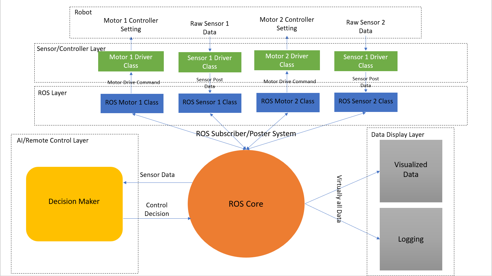
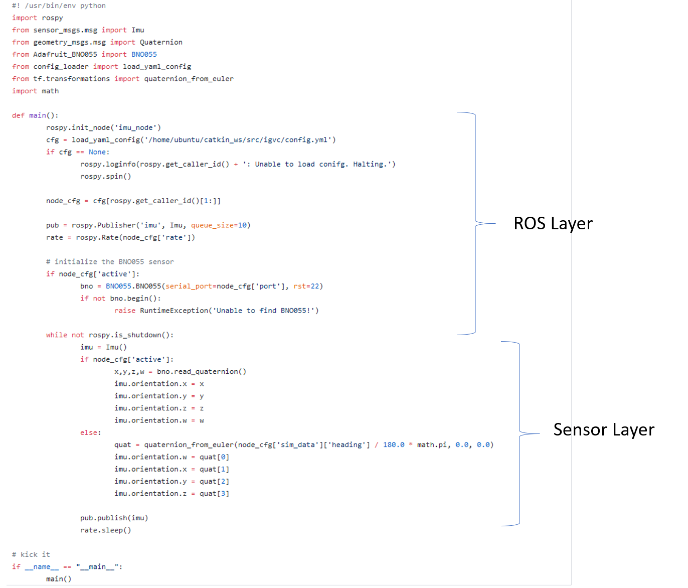

# Start of the actual source code

This folder is meant to describe to you how the overall Lunabotics and IGV code will be implemented.

## The code structure
Because of ROS, all of the different components of the robot are going to be handled in essentially the same way. 

### These are the layers of the program and how they interact with each other:
* Controller/Sensor Layer: This is the layer of the code that will actually talk to the sensor/motor/actuator using its specific driver. And format 
* ROS Layer: This layer is simply the thing that accesses the info from the ROS core, and passes on the info to its respective controller or sensor. This should post sensor data to the core, or pull (subscribe) data to set motors/actuators. 
* ROS Core: This is the central container that all of the different ROS layers talk to, and listen from. This is not code you write, but an environment you setup on the OS. 
* Data Display Layer: This is how a layer that plugs into the ROS core to just listen, and takes the information it hears and displays it to use in a human readable way. 
* AI/Remote Control Layer: This is the part of code that will take in sensor data and give controls for the ROS Core to give to the respective motor/actuator etc. 

_NOTE: these things should be pretty foreign to you, further discussion on how these work will come in the coming weeks._

The IGV team has developed in this format with the GPS and IMU, just with the sensor/control and ros layer not explicitly seperated. You can see the layers here: 

### The sensors/controllers that need to be setup in this way
Each one of these as listed will need a respective ROS Layer and Controller/Sensor Layer Object dedicated to it. 

| Lunabotics     | IGV               | Both                         | 
|----------------|-------------------|------------------------------|
| Dig Motor      | GPS               | Intel Realsense Depth Camera | 
| Dig Arm        | Lidar             | IMU (Telemetry)              |
| Dig Actuator   | Wheelchair Drive  |                              |
| Dump Arm/Motor |                   |                              |
| Drive Motors   |                   |                              |

## Task #1: Create ROS & Sensor/Controller Layer
* ROS Layer should be generalized to the _type_ of thing it is talking to. It should not care what model of drive motor you are using, just that it is a drive motor.
* Sensor/Controller Layer should care what model of thing it is and provide the ROS Layer with some universal methods to look for like "read" and "post".

**Programming tasks for Task #1 are going to start to be assigned to people, and these will be the primary goal of the club members to create, collaborate on and maintain.**

## Task #2: Get Remote Control Layer working
* David and Josh A. will work on remote control later concurrently with task #3 since it uses the same interface.

## Task #3: Get Logging and Display Layer Working
* David and Josh A. will work on this first so that there is a display layer for other groups' testing.

## Task #4: Start on AI Layer
* Cole and Josh A. will begin devolping this once logging and classical control is developed. Simulation training can begin ASAP.
